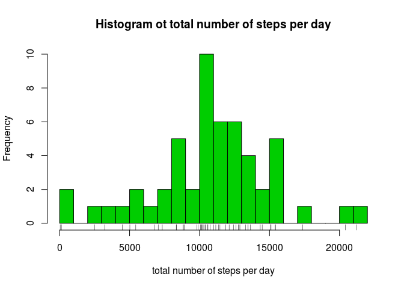
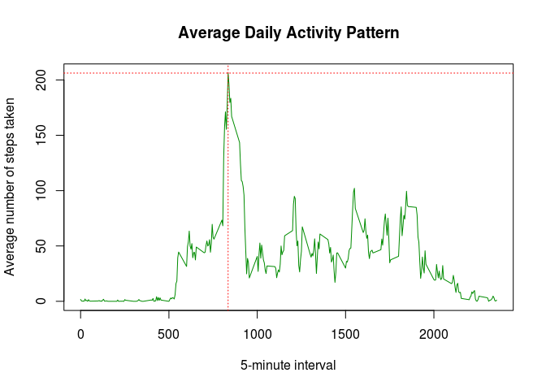
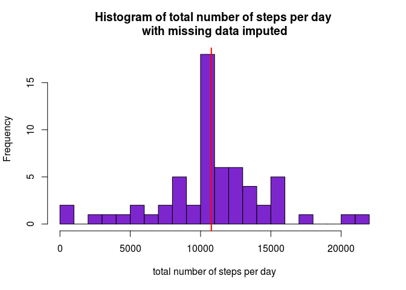
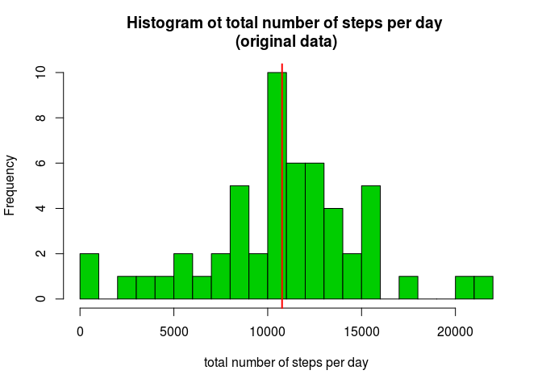
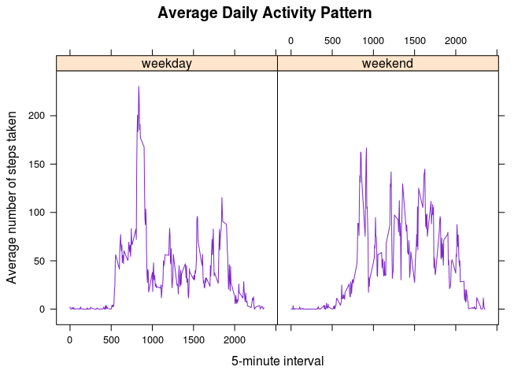

# Reproducible Research: Peer Assessment 1
Erik Pinter  
08.10.2016  


## Loading and preprocessing the data

Show any code that is needed to:

* Load the data (i.e. read.csv())

```r
# download file to working directory, unzip and save to variable 'df'
download.file('https://d396qusza40orc.cloudfront.net/repdata%2Fdata%2Factivity.zip', 'repdata_data_activtiy.zip')
unzip ('repdata_data_activtiy.zip')
df <- read.csv('activity.csv', stringsAsFactors = FALSE)
```

* Process/transform the data (if necessary) into a format suitable for your analysis

```r
# convert imported dates from chr-class to Date-class
df$date <- ymd(df$date)
```


## What is mean total number of steps taken per day?

For this part of the assignment, you can ignore the missing values in the dataset.

* Calculate the total number of steps taken per day

```r
# group by date and calculate total number of steps per day
df_stepsperday <- df %>% 
        group_by(date) %>% 
        summarise(totalsteps = sum(steps))
```

* Make a histogram of the total number of steps taken each day.

```r
# histogram of total number of steps taken each day, using the base plotting system
hist(df_stepsperday$totalsteps, breaks = 20,
     main = "Histogram ot total number of steps per day",
     xlab = "total number of steps per day",
     col ="green3")
rug(df_stepsperday$totalsteps)          # add rug to histogram
```

<!-- -->

* Calculate and report the mean and median of the total number of steps taken per day

```r
# ungroup data and calculate and print mean and median
df_stepsperday <- ungroup(df_stepsperday)
mean(df_stepsperday$totalsteps, na.rm = TRUE)
```

```
## [1] 10766
```

```r
median(df_stepsperday$totalsteps, na.rm = TRUE)
```

```
## [1] 10765
```

**Answer**  
The **mean** total number of steps taken per day is: **\Sexpr10766.19**.
The **median** of the total number of steps taken per day is: **\Sexpr 10765**.  


## What is the average daily activity pattern?
* Make a time series plot (i.e. type = "l") of the 5-minute interval (x-axis) and the average number of steps taken, averaged across all days (y-axis)

```r
# group by 'interval' and calculate average number of steps per interval
df_stepsperinterval <- df %>% 
        group_by(interval) %>% 
        summarise(avgsteps = mean(steps, na.rm = TRUE))

# make a time series plot, using base plotting system
plot(df_stepsperinterval$interval, df_stepsperinterval$avgsteps, type = "l",
     main = "Average Daily Activity Pattern",
     xlab = "5-minute interval",
     ylab = "Average number of steps taken",
     col ="green4")

# show the max value on the plot
abline(v = df_stepsperinterval$interval[which.max(df_stepsperinterval$avgsteps)], col= "red", lty = 3)
abline(h = max(df_stepsperinterval$avgsteps), col= "red", lty = 3)
```

<!-- -->

* Which 5-minute interval, on average across all the days in the dataset, contains the maximum number of steps?

```r
# find 5-minute interval with the max average steps 
df_stepsperinterval$interval[which.max(df_stepsperinterval$avgsteps)]
```

```
## [1] 835
```

**Answer**  
The 5-minute interval: **835** includes the **maximum** number of steps: **206.17**.  


## Imputing missing values

Note that there are a number of days/intervals where there are missing values (coded as NA). The presence of missing days may introduce bias into some calculations or summaries of the data.

* Calculate and report the total number of missing values in the dataset (i.e. the total number of rows with NAs)

```r
# calculate the number of rows with missing numbers
sum(is.na(df))
```

```
## [1] 2304
```

**Answer**  
The total number of rows with missing values (NA) is: **2304**. This equals to about **13.11 percent** of the total data.  


* Devise a strategy for filling in all of the missing values in the dataset. The strategy does not need to be sophisticated. For example, you could use the mean/median for that day, or the mean for that 5-minute interval, etc.

```r
# STRATEGY: fill missing values by using the 5-minute interval mean for the given interval

# add a column to df with the average number of steps per interval
df <- df %>% 
        group_by(interval) %>% 
        mutate(interval_avgsteps = mean(steps, na.rm = TRUE))
# ungroup(df)
```

* Create a new dataset that is equal to the original dataset but with the missing data filled in.

```r
# create a new dataset df2 with missing values filled in
df2 <- df[1:3]                          # copy the columns 1 to 3 of the original data
df2[is.na(df2), 1] <- df[is.na(df), 4]  # if the value in column 1 is 'NA', use the calculated value in column 4 
```

* Make a histogram of the total number of steps taken each day and Calculate and report the mean and median total number of steps taken per day. Do these values differ from the estimates from the first part of the assignment? What is the impact of imputing missing data on the estimates of the total daily number of steps?

```r
# group by date and calculate total number of steps per day
df2_stepsperday <- df2 %>% 
        group_by(date) %>% 
        summarise(totalsteps = sum(steps))

# histogram of total number of steps taken each day
par(mfrow=c(1,1))

# histogram of data with missing data filled in 
hist(df2_stepsperday$totalsteps, breaks = 20,
     main = "Histogram of total number of steps per day \nwith missing data imputed",
     xlab = "total number of steps per day",
     col ="purple3") 
abline(v= median(df2_stepsperday$totalsteps, na.rm = TRUE), col = "red", lwd=2)          # red line for median
```

<!-- -->

```r
# histogram of original data 
hist(df_stepsperday$totalsteps, breaks = 20,
     main = "Histogram ot total number of steps per day \n(original data)",
     xlab = "total number of steps per day",
     col = "green3")
abline(v= median(df_stepsperday$totalsteps, na.rm = TRUE), col = "red", lwd=2)          # red line for median
```

<!-- -->

```r
# ungroup data and calculate mean and median
df2_stepsperday <- ungroup(df2_stepsperday)
mean(df2_stepsperday$totalsteps, na.rm = TRUE)
```

```
## [1] 10766
```

```r
median(df2_stepsperday$totalsteps, na.rm = TRUE)
```

```
## [1] 10766
```

**Answer**  
The **mean** total number of steps taken per day of the *dataset with missing values filled in* is: **10766.19** compared to **10766.19** of the *original dataset*.  
The **median** of the total number of steps taken per day of the *dataset with missing values filled in* is: **10766.19** compared to **10765** of the *original dataset*. 


## Are there differences in activity patterns between weekdays and weekends?

For this part the weekdays() function may be of some help here. Use the dataset with the filled-in missing values for this part.

* Create a new factor variable in the dataset with two levels – “weekday” and “weekend” indicating whether a given date is a weekday or weekend day.

```r
# create a new column with factor variable for the weekdays in the specified order (This works for english locale only!)
df2$dayofweek <- factor(weekdays(df2$date, abbreviate = TRUE), levels = c("Mon", "Tue", "Wed", "Thu", "Fri", "Sat", "Sun"))

# change levels of factor variable to "weekdays" and "weekends" 
levels(df2$dayofweek) <- c("weekday", "weekday", "weekday", "weekday", "weekday", "weekend", "weekend")
```

* Make a panel plot containing a time series plot (i.e. type = "l") of the 5-minute interval (x-axis) and the average number of steps taken, averaged across all weekday days or weekend days (y-axis). See the README file in the GitHub repository to see an example of what this plot should look like using simulated data.

```r
# group by interval and calculate average number of steps per interval
df2_stepsperinterval <- df2 %>% 
        group_by(dayofweek, interval) %>% 
        summarise(avgsteps = mean(steps, na.rm = TRUE))

# make panel plot, using lattice plotting system
xyplot(avgsteps ~ interval | dayofweek, data = df2_stepsperinterval, type = "l",
     main = "Average Daily Activity Pattern",
     xlab = "5-minute interval",
     ylab = "Average number of steps taken",
     col ="purple3")
```

<!-- -->

